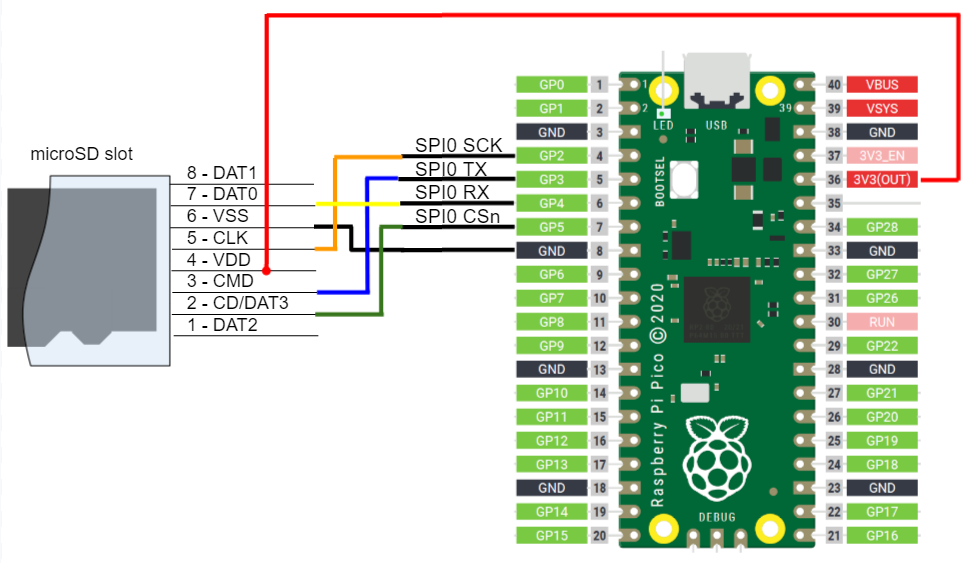

# Raspberry Pi Pico FatFs Test

## Overview
This project is an implementation example of FatFs on Raspberry Pi Pico.
This project supports:
* FatFs R0.13c ([http://elm-chan.org/fsw/ff/00index_e.html](http://elm-chan.org/fsw/ff/00index_e.html))
* SD card access by SPI interface
* SD, SDHC, SDXC cards
* FAT16, FAT32, exFAT formats
* write / read speed benchmark

## Supported Board
* Raspberry Pi Pico

## Ciruit Diagram


## Pin Assignment
### microSD card connector

| Pico Pin # | Pin Name | Function | microSD connector |
----|----|----|----
|  4 | GP2 | SPI0_SCK | CLK (5) |
|  5 | GP3 | SPI0_TX | CMD (3) |
|  6 | GP4 | SPI0_RX | DAT0 (7) |
|  7 | GP5 | SPI0_CSn | CD/DAT3 (2) |
|  8 | GND | GND | VSS (6) |
| 36 | 3V3(OUT) | 3.3V | VDD (4) |

#### Caution
* SPI0_TX and SPI0_RX needs to be pull-ed up by 10Kohm.
* Wire length between Pico and SD card is very sensitive. Short wiring as possible is desired, otherwise errors such as Mount error, Preallocation error and Write fail will occur.

### Serial (CP2102 module)
| Pico Pin # | Pin Name | Function | CP2102 module |
----|----|----|----
|  1 | GP0 | UART0_TX | RXD |
|  2 | GP1 | UART0_RX | TXD |
|  3 | GND | GND | GND |

## How to build
* See ["Getting started with Raspberry Pi Pico"](https://datasheets.raspberrypi.org/pico/getting-started-with-pico.pdf)
* Build is confirmed only in Developer Command Prompt for VS 2019 and Visual Studio Code on Windows enviroment
* Put "pico-sdk" and "pico-examples" on the same level with this project folder.
```
> git clone -b master https://github.com/raspberrypi/pico-sdk.git
> cd pico-sdk
> git submodule update -i
> cd ..
> git clone -b master https://github.com/raspberrypi/pico-examples.git
> 
> git clone -b main https://github.com/elehobica/pico_fatfs_test.git
```
* Lanuch "Developer Command Prompt for VS 2019"
```
> cd pico_fatfs_test
> mkdir build
> cd build
> cmake -G "NMake Makefiles" ..
> nmake
```
* Put "sine_wave.uf2" on RPI-RP2 drive

## Benchmark Result
* PQI microSD 1GB
```
=====================
== pico_fatfs_test ==
=====================
mount ok
Type is FAT16
Card size:    1.02 GB (GB = 1E9 bytes)

FILE_SIZE_MB = 5
BUF_SIZE = 512 bytes
Starting write test, please wait.

write speed and latency
speed,max,min,avg
KB/Sec,usec,usec,usec
72.5232, 163334, 3178, 7056
72.0093, 162820, 3192, 7107

Starting read test, please wait.

read speed and latency
speed,max,min,avg
KB/Sec,usec,usec,usec
788.7175, 1531, 629, 648
788.8419, 1530, 629, 648
```

* Memorex microSD 2GB
```
=====================
== pico_fatfs_test ==
=====================
mount ok
Type is FAT16
Card size:    2.00 GB (GB = 1E9 bytes)

FILE_SIZE_MB = 5
BUF_SIZE = 512 bytes
Starting write test, please wait.

write speed and latency
speed,max,min,avg
KB/Sec,usec,usec,usec
80.7494, 215875, 2452, 6337
78.3305, 209957, 2457, 6512

Starting read test, please wait.

read speed and latency
speed,max,min,avg
KB/Sec,usec,usec,usec
740.6934, 1463, 533, 690
740.9128, 1200, 533, 690
```

* Transcend microSDHC 32GB (C4)
```
=====================
== pico_fatfs_test ==
=====================
mount ok
Type is FAT32
Card size:   31.90 GB (GB = 1E9 bytes)

FILE_SIZE_MB = 5
BUF_SIZE = 512 bytes
Starting write test, please wait.

write speed and latency
speed,max,min,avg
KB/Sec,usec,usec,usec
246.7272, 210649, 952, 2073
242.1504, 209519, 951, 2113

Starting read test, please wait.

read speed and latency
speed,max,min,avg
KB/Sec,usec,usec,usec
889.9395, 1110, 503, 574
889.9395, 1108, 503, 574
```

* Toshiba microSDXC 64GB (UHS-I C10)
```
=====================
== pico_fatfs_test ==
=====================
mount ok
Type is EXFAT
Card size:   61.89 GB (GB = 1E9 bytes)

FILE_SIZE_MB = 5
BUF_SIZE = 512 bytes
Starting write test, please wait.

write speed and latency
speed,max,min,avg
KB/Sec,usec,usec,usec
156.5629, 169867, 2066, 3267
154.6404, 175743, 2071, 3309

Starting read test, please wait.

read speed and latency
speed,max,min,avg
KB/Sec,usec,usec,usec
663.0875, 920, 584, 771
662.9117, 920, 584, 771
```

* SanDisk microSDXC Ultra A1 64GB (UHS-I U1)
```
=====================
== pico_fatfs_test ==
=====================
mount ok
Type is EXFAT
Card size:   63.83 GB (GB = 1E9 bytes)

FILE_SIZE_MB = 5
BUF_SIZE = 512 bytes
Starting write test, please wait.

write speed and latency
speed,max,min,avg
KB/Sec,usec,usec,usec
465.8232, 20130, 878, 1098
464.5247, 18138, 882, 1101

Starting read test, please wait.

read speed and latency
speed,max,min,avg
KB/Sec,usec,usec,usec
1362.6819, 384, 362, 374
1362.6819, 384, 368, 375
```

* SanDisk microSDXC Ultra A1 512GB (UHS-I U1)
```
=====================
== pico_fatfs_test ==
=====================
mount ok
Type is EXFAT
Card size:  511.80 GB (GB = 1E9 bytes)

FILE_SIZE_MB = 5
BUF_SIZE = 512 bytes
Starting write test, please wait.

write speed and latency
speed,max,min,avg
KB/Sec,usec,usec,usec
431.9005, 5581, 948, 1184
390.0515, 138870, 950, 1311

Starting read test, please wait.

read speed and latency
speed,max,min,avg
KB/Sec,usec,usec,usec
1309.5023, 425, 378, 390
1309.5023, 427, 378, 390
```
